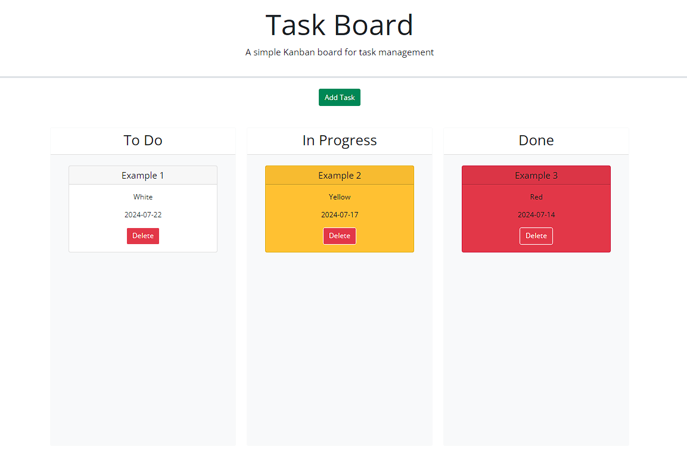
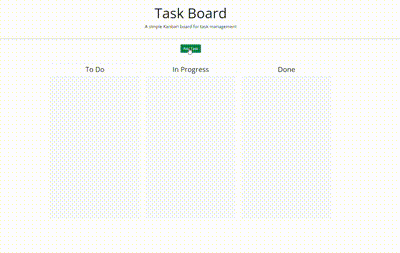

# Brain Dump

## Description
The purpose of this simple Kanban board titled [Brain Dump](https://ther16h.github.io/Brain-Dump/) is to so you can type out your objectives / things you need to do in the coming days! 
- by default each task will appear white.
- If the deadline is within 2-3 the task will appear yellow. 
- if the deadline is today (or has passed) the task will appear red so it's easy to differentiate. 

## Table Of Contents
- [Visuals](#visuals)
- [Usage](#usage)
- [Support](#support)
- [Acknowledgements](#acknowledgements)
- [License](#license)

## Visuals

## Usage
Simply type in the title/description/deadline of your task and then you can drag it and drop it based off of how far you are in its specific development.

## Support
Find me on [Github](https://github.com/TheR16H) to ask any questions or see any of my other works!

## Acknowledgements
[Jquery docs](https://api.jqueryui.com/draggable/).

## License 
MIT License

Copyright (c) 2024 Rashawn Hall

Permission is hereby granted, free of charge, to any person obtaining a copy
of this software and associated documentation files (the "Software"), to deal
in the Software without restriction, including without limitation the rights
to use, copy, modify, merge, publish, distribute, sublicense, and/or sell
copies of the Software, and to permit persons to whom the Software is
furnished to do so, subject to the following conditions:

The above copyright notice and this permission notice shall be included in all
copies or substantial portions of the Software.

THE SOFTWARE IS PROVIDED "AS IS", WITHOUT WARRANTY OF ANY KIND, EXPRESS OR
IMPLIED, INCLUDING BUT NOT LIMITED TO THE WARRANTIES OF MERCHANTABILITY,
FITNESS FOR A PARTICULAR PURPOSE AND NONINFRINGEMENT. IN NO EVENT SHALL THE
AUTHORS OR COPYRIGHT HOLDERS BE LIABLE FOR ANY CLAIM, DAMAGES OR OTHER
LIABILITY, WHETHER IN AN ACTION OF CONTRACT, TORT OR OTHERWISE, ARISING FROM,
OUT OF OR IN CONNECTION WITH THE SOFTWARE OR THE USE OR OTHER DEALINGS IN THE
SOFTWARE.
